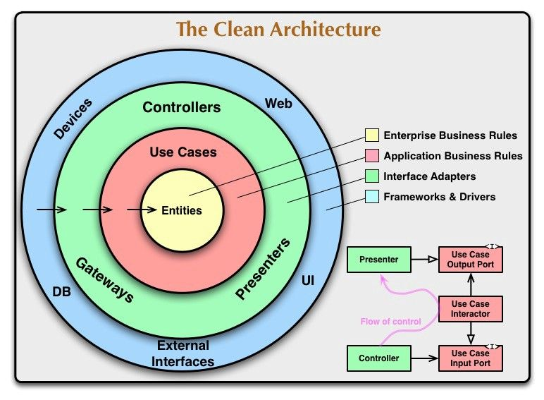

## Cadastro de Propriedades
- Colocar os atributos relacionados a àrea que estão em uma classe separada (PropertyArea) na própria classe de propriedade.
- Atributo de produtor (private User producer) será um usuário do sistema, que poderá ser um novo usuário, geralmente no 
- cadastro de uma propriedade um novo usuário será criado, mas também poderá haver casos em que uma nova propriedade estará 
- relacionada com um cadastro existente. Ao cadastrar uma propriedade o usuário irá informar os dados do produtor: 
- Nome, CPF e Email, se o CPF já existir na base, faz o vínculo, senão cadastra um novo usuário. 
- Ajustar a autenticação para possibilitar autenticar pelo email ou CPF (username). 
- Podemos colocar um email fake na base, ex.:
  if (entity.getProducer().getUsername() == null) {
  entity.getProducer().setUsername("produtor_%d@idrparana.pr.gov.br".formatted(System.currentTimeMillis()));
  entity.getProducer().setPassword("%d".formatted(System.currentTimeMillis()));
  }
  A ideia de ao cadastrar a propriedade sempre informar os dados do produtor, será para evitar ter que sincronizar todos 
- os usuários do tipo produtor para o ambiente offline, por exemplo. Assim carregamos apenas os usuários relacionados 
- com as propriedades da visita. Não precisa necessariamente seguir esta regra, é apenas uma sugestão para diminuir a 
- carga do cliente para o servidor.

## Online/Offline
- Iniciar pelo CRUD de propriedades.
- Criar a estrutura para sincronização dos dados entre cliente e API, criar um campo para versionar o registro.
- Lembrar de armazenar as datas de criação do registro, atualização do registro, bem como o usuário responsável por 
- essas alterações, pode utilizar as anotações padrão JPA.
- Criar um endpoint para o carregamento dos dados da API > Cliente.
- Criar um endpoint para o upload dos dados do Cliente > API.

---

# 🏗️ Arquitetura e Organização do Projeto

Este projeto está em transição para uma **Arquitetura Hexagonal (Portas e Adaptadores)**, organizada por **Contextos Delimitados (Bounded Contexts)**. O objetivo é isolar as regras de negócio de frameworks e facilitar a manutenção a longo prazo.

## 📂 Estrutura de Camadas (Padrão por Contexto)
Cada contexto em `br.pr.gov.idr_parana` segue a estrutura:
- **domain/**: Modelos de domínio (Entities, Records, Factory Methods) e Domain Services. Sem dependências de Spring/JPA.
- **application/**: Portas de entrada (UseCases), portas de saída (RepositoryPorts) e Serviços de Aplicação (Orquestradores).
- **infrastructure/**: Adaptadores de entrada (Web/REST) e saída (Persistence/JPA). É onde o MapStruct e o Spring Data residem.

---

## 🗺️ Mapeamento de Contextos Delimitados

Abaixo estão definidos os contextos e as entidades que devem ser migradas para cada um:

### 1. `property_management` (Gestão de Propriedades)
Responsável por todo o ecossistema da propriedade rural e sua localização.
- **Entidades:** `Property`, `PropertyArea`, `PropertyAttachment`, `PropertyCollaborator`, `PropertyTechnician`, `PropertyEquipImprove`, `Region`, `City`.

### 2. `livestock` (Pecuária)
Responsável pelo manejo, vida e saúde animal.
- **Entidades:** `Animal`, `Breed`, `AnimalDiseases`, `AnimalPurchases`, `AnimalSales`, `Insemination`, `PregnancyDiagnose`, `Mastitis`, `Disease`.

### 3. `crop_management` (Gestão de Culturas/Vegetal)
Responsável pelo plantio, manejo agrícola e controle de pragas.
- **Entidades:** `Culture`, `GeneralCultivations`, `ForageDisponibility`, `PerennialAnualForage`, `VegetableDisease`, `VegetablePlague`, `Plague`.

### 4. `inventory_resource` (Insumos e Recursos)
Responsável pelo controle de produtos e materiais utilizados nas atividades.
- **Entidades:** `Product`, `ProductCategory`, `Medication`, `ActivePrinciple`, `LandProduct`.

### 5. `iam` (Identity and Access Management)
Responsável pela segurança, usuários e permissões de acesso.
- **Entidades:** `User`, `Permission`, `Token`, `ChangePassword`, `CompositeUserPermission`, `CompositeUserRegion`.

---

## 🚀 Guia de Migração (Best Practices)
1. **Domínio Primeiro:** Ao migrar uma entidade, comece criando o modelo puro no `domain` com métodos estáticos de fábrica (Effective Java).
2. **DTOs:** Utilize `records` para `Request` e `Response` na camada de infraestrutura.
3. **Mapeamento:** Utilize o **MapStruct** (com `componentModel = "spring"`) para converter entre Domínio e JPA.
4. **Desacoplamento:** A camada de aplicação não deve conhecer o JPA ou o Controller. Ela se comunica apenas através de Portas (Interfaces).